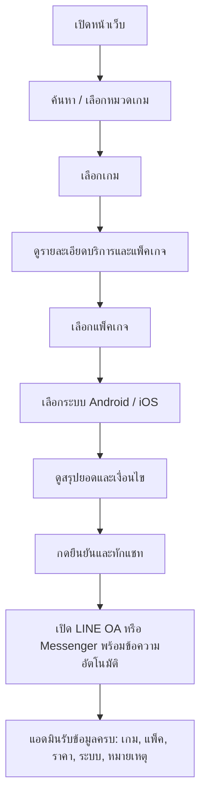

# 1. Architecture & User Flow

## เป้าหมาย

ลดขั้นตอนจากระบบเดิม:

```text
ลูกค้าเห็นโพสต์ Facebook -> ถามราคา -> ส่งรูปเกม -> ถามระบบ -> ถามแพ็ค -> รอแอดมินสรุป
```

ให้กลายเป็น:

```text
เข้าเว็บ -> ค้นหาเกม -> เลือกแพ็คเกจ -> เลือกระบบ -> กดทักแชท -> แอดมินได้รับข้อมูลพร้อมทำงาน
```

## Customer Journey



## UX Logic

| ขั้นตอน | สิ่งที่ลูกค้าเห็น | จุดประสงค์ |
|---|---|---|
| Home | Hero, Search, Game Categories | ให้เจอเกมเร็ว |
| Game Detail | แพ็คเกจ, ราคา, รองรับระบบ, รับประกัน | ตัดสินใจได้เอง |
| Order Summary | สรุปรายการก่อนทัก | ลดถามซ้ำ |
| Chat Handoff | ข้อความพร้อมส่งเข้า LINE/Facebook | ปิดการขายเร็ว |

## Suggested Modules

```text
/home
  Hero
  Search
  Game Categories
  Featured Games
  Warranty Strip

/games
  Game List
  Filters
  Search

/games/[slug]
  Game Detail
  Package Selector
  Platform Selector
  Order Summary
  Chat CTA

/admin
  Manage Games
  Manage Packages
  Manage Leads
```

